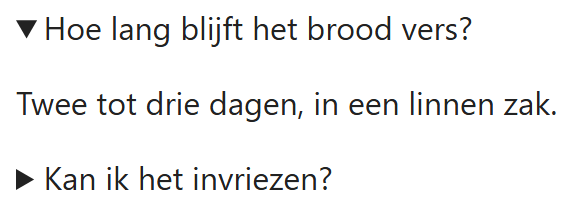
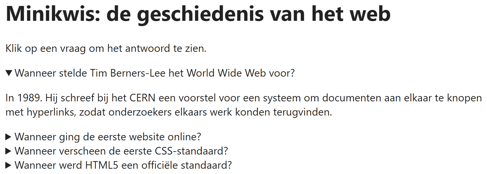

## Theorie

Met `<details>` maak je een uitklapbaar blok. De zichtbare titel zet je in `<summary>`; de rest verschijnt bij het openklappen.

```html
<details>
   <summary>Lees meer</summary>
   <p>Verborgen inhoud die verschijnt bij het openklappen.</p>
</details>
```

Geef je meerdere blokken hetzelfde `name`, dan vormen ze samen een **accordeon**: er kan er dan maar één tegelijk openstaan, want zodra je er een opent klapt de vorige dicht. Zonder `name` staan de blokken los van elkaar en mogen ze allemaal tegelijk openstaan. Wil je dat een blok al open is bij het laden van de pagina, dan zet je er `open` bij.

```html
<details name="faq" open><!-- staat meteen open -->
   <summary>Hoe lang blijft het brood vers?</summary>
   <p>Twee tot drie dagen, in een linnen zak.</p>
</details>
<details name="faq"><!-- zelfde name: sluit het vorige -->
   <summary>Kan ik het invriezen?</summary>
   <p>Ja, in sneden, tot drie maanden.</p>
</details>
```

Resultaat:



## Opdracht

Maak van de vier vragen hieronder een minikwis: het antwoord verschijnt pas als je op de vraag klikt, er kan er maar één tegelijk openstaan, en de eerste vraag staat al open wanneer de pagina laadt.

## Screenshot


