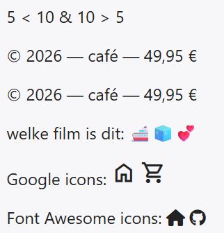
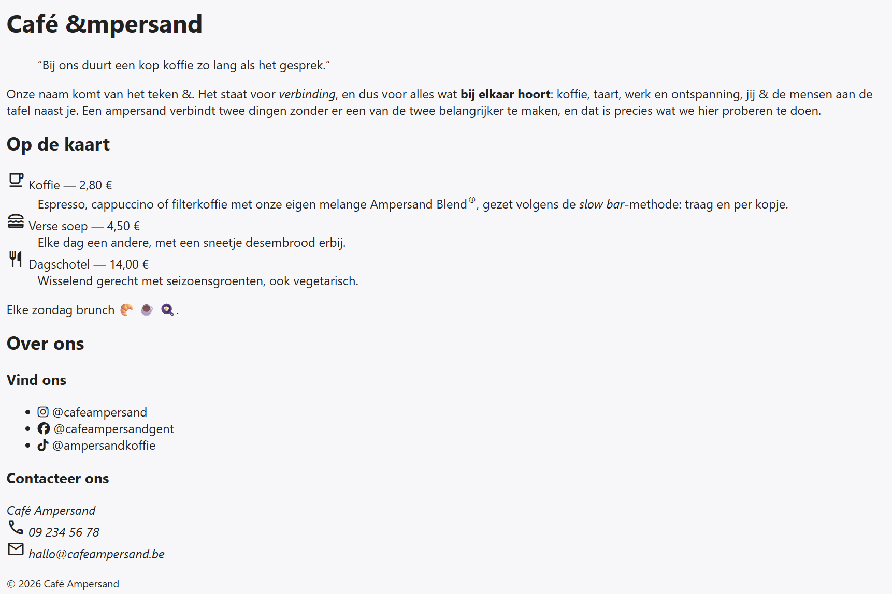

## Theorie

- **Karaktercodering** – `<`, `>` en `&` noteer je als `&lt;`, `&gt;` en `&amp;` om verwarring met HTML code te vermijden
- **Speciale tekens** – karakters met accenten, symbolen enz... (é, ©, €, →) kan je gewoon typen, coderen (bv. `&reg;` wordt ®) of van het Internet kopiëren
- **Emoji's** – tekens als 😀🦄💣 kan je gewoon typen (Windows-sneltoets: `Win` + `.`) of kopiëren van het internet
- **Icon fonts** – dit zijn gratis of commerciële iconensets die je kan importeren en gebruiken in je pagina

De bekendste icon fonts zijn **Google Icons** en **FontAwesome**, zie de [uitleg in de online HTML cursus](https://rogiervdl.github.io/HTML-course/02_tekst.html#google-icon) over hoe ze te importeren en gebruiken. Codevoorbeeld:

```html
<p>5 &lt; 10 &amp; 10 &gt; 5</p><!-- gecodeerde karakters -->
<p>© 2026 — café — 49,95 €</p><!-- speciale tekens getypt -->
<p>&copy; 2026 &mdash; caf&eacute; &mdash; 49,95 &euro;</p><!-- speciale tekens gecodeerd -->
<p>welke film is dit: 🚢🧊💕</p><!-- emoji's getypt -->
<p>
   Google icons:
   <span class="material-symbols-outlined">home</span><!-- Google Icons: naam in de inhoud -->
   <span class="material-symbols-outlined">shopping_cart</span>
</p>
<p>
   Font Awesome icons:
   <span class="fa-solid fa-house"></span><!-- FontAwesome: naam in de class -->
   <span class="fa-brands fa-github"></span><!-- fa-brands: logo's van merken -->
</p>
```

Resultaat:



## Opdracht

Schrijf de HTML naar voorbeeld van de screenshot. De iconen zijn van Google Icons, enkel de iconen onderaan zijn van FontAwesome. In deze startcode zijn beide icon sets al gekoppeld (bovenaan `styles.css`), dus je kan ze gewoon opzoeken en gebruiken via [fonts.google.com/icons](https://fonts.google.com/icons) en [fontawesome.com/search](https://fontawesome.com/search).

## Screenshot


