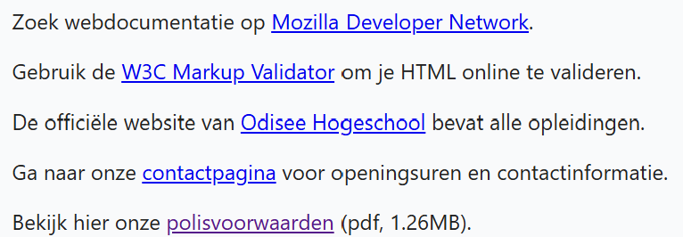

## Theorie

Zie [https://rogiervdl.github.io/HTML-course/03_links.html](https://rogiervdl.github.io/HTML-course/03_links.html).

## Opdracht

Maak de vijf aangegeven teksten klikbaar. 

1. link de tekst "Mozilla Developer Network" naar *https://developer.mozilla.org/*
2. link de teksten "W3C Markup Validator" en "Odisee Hogeschool" (zoek zelf de URL op)
3. de contactpagina heet *contact.html* en staat in dezelfde map als deze pagina
4. de pdf met polisvoorwaarden heet *polisvoorwaarden.pdf* en staat in een submap *downloads*

## Screenshot

