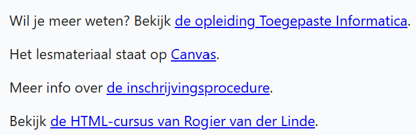

## Theorie

De gelinkte tekst moet beschrijven **waar de link naartoe gaat** – niet "klik hier", "hier" of "meer info". Vage linktekst is ontoegankelijk voor blinden (screenreaders lezen enkel de linktekst voor) en schaadt de indexering door zoekmachines.

## Opdracht

Herstel alle vage linkteksten. Pas enkel de linktekst aan, niet de `href`.

## Screenshot

