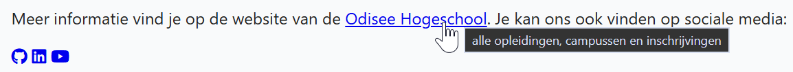

## Theorie

De uitgebreide uitleg vind je vanaf [https://rogiervdl.github.io/HTML-course/03_links.html#title-attribuut](https://rogiervdl.github.io/HTML-course/03_links.html#title-attribuut)

`title="..."` **voegt extra info toe** en verschijnt als tooltip bij hover met de muis; op toestellen zonder muis of trackpad heeft het dus geen effect.

`aria-label="..."` **vervangt de linktekst** voor screenreaders en is zelf nooit zichtbaar. Je hebt het nodig bij een link zonder tekst – een icoon of een afbeelding – want anders leest een screenreader gewoon de URL voor. Heeft de link al zichtbare tekst, gebruik dan geen `aria-label`.

## Opdracht

Maak de links hieronder toegankelijk.

1. de eerste link heeft al een duidelijke tekst; geef het nu als extra ook een tooltip met de tekst "alle opleidingen, campussen en inschrijvingen"
2. de drie iconlinks bevatten enkel een icoon, en zijn dus niet duidelijk voor blinden: geef ze elk een beschrijving voor screenreaders (kies zelf een tekst)

## Screenshot

