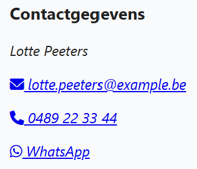

## Theorie

De uitgebreide uitleg vind je op [https://rogiervdl.github.io/HTML-course/03_links.html#media-links](https://rogiervdl.github.io/HTML-course/03_links.html#media-links)

Gebruik `href="mailto:adres"` voor een e-maillink en `href="tel:+landcodenummer"` voor een telefoonlink. Schrijf het telefoonnummer altijd in internationale notatie (b.v. `+32489223344` voor een Belgisch nummer).

## Opdracht

Maak de contactgegevens klikbaar. Voeg ook een WhatsApp-link toe naar hetzelfde nummer. Link telkens icoon én tekst.

## Screenshot

