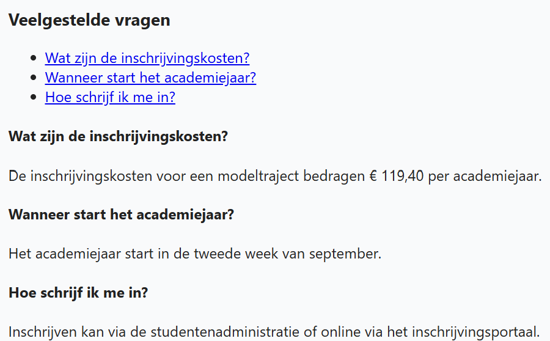

## Theorie

Een anker linkt naar een element **op dezelfde pagina**. Je hebt twee dingen nodig: een `id` op het doelelement (`<h3 id="vraag1">`) en een link met `#` ernaar (`<a href="#vraag1">`). Handig voor lange pagina's met een navigatiemenu bovenaan.

## Opdracht

Maak de FAQ navigeerbaar: koppel elk item in de inhoudstafel aan de bijhorende sectie.

## Screenshot

