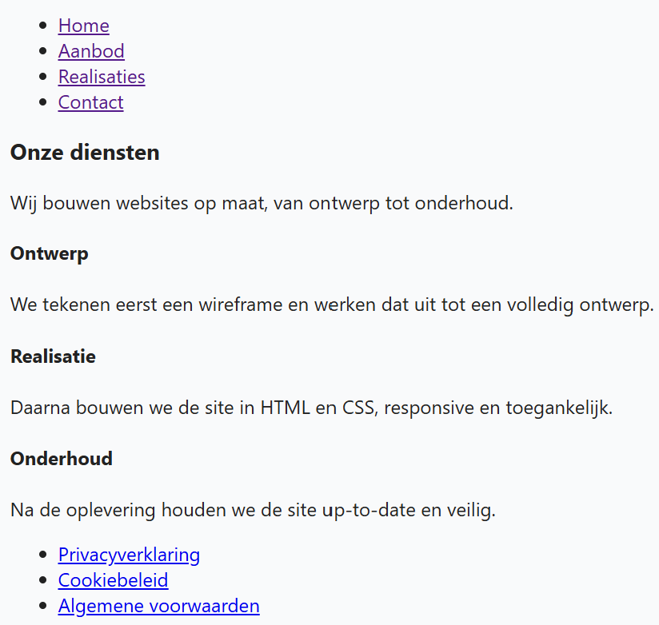

## Theorie

Een menu is een **opsomming van links**, en dus bouw je het altijd met `<ul>`, `<li>` en `<a>` – nooit als een reeks losse `<a>`-elementen naast elkaar. Een screenreader kondigt een lijst aan als "lijst met 4 items" en telt mee waar je zit; zonder lijst hoort de gebruiker enkel vier losse links zonder te weten dat ze bij elkaar horen.

Dat geldt voor **elke** groep links die bij elkaar hoort: het **hoofdmenu** bovenaan met de pagina's van de site, maar evengoed het **eindmenu** onderaan met links als privacy en voorwaarden.

Standaard staan de items onder elkaar met bolletjes. Dat is normaal: met CSS (komt later in de cursus aan bod) zet je ze naast elkaar en haal je de bolletjes weg. De HTML blijft dezelfde.

```html
<ul>
   <li><a href="index.html">Home</a></li>
   <li><a href="contact.html">Contact</a></li>
</ul>
```

Als je de URL's van de links nog niet kent, mag je ze voorlopig leeglaten:

```html
<ul>
   <li><a href="">Home</a></li>
   <li><a href="">Contact</a></li>
</ul>
```

## Opdracht

De pagina hieronder heeft nog geen menu's. Voeg ze toe.

1. zet bovenaan het hoofdmenu: Home, Aanbod, Realisaties en Contact (URL's zijn nog niet gekend)
2. zet onderaan het eindmenu: Privacyverklaring (*privacy.html*), Cookiebeleid (*cookies.html*) en Algemene voorwaarden (*voorwaarden.html*)

## Screenshot


