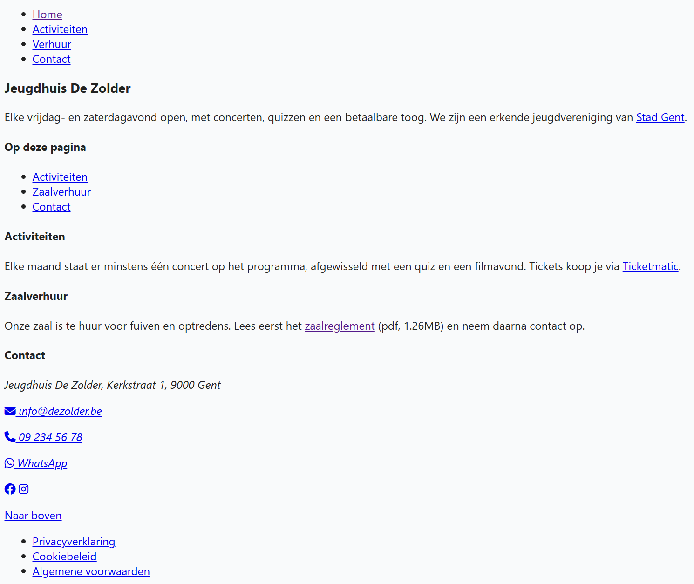

## Opdracht

De pagina hieronder is de startpagina van een jeugdhuis, maar er staat nog geen enkele link in. Voeg ze allemaal toe.

1. zet bovenaan het hoofdmenu: Home (*index.html*), Activiteiten (*activiteiten.html*), Verhuur (*verhuur.html*) en Contact (*contact.html*)
2. maak van "Op deze pagina" een inhoudstafel met ankerlinks naar de drie secties eronder
3. link "Stad Gent" en "Ticketmatic" naar hun website (zoek zelf de URL op), en geef de link naar de stad een tooltip met extra uitleg
4. het zaalreglement heet *reglement.pdf* en staat in de submap *downloads*
5. maak de contactgegevens aanklikbaar: e-mail, telefoon en WhatsApp, telkens met icoon én tekst
6. de twee sociale-mediaknoppen bevatten enkel een icoon: geef ze elk een beschrijving voor screenreaders
7. zet onderaan een link "Naar boven" die naar de titel van de pagina springt
8. zet onderaan het eindmenu: Privacyverklaring (*privacy.html*), Cookiebeleid (*cookies.html*) en Algemene voorwaarden (*voorwaarden.html*)

## Tip

*Let bij elke link op de linktekst: die moet beschrijven waar de link naartoe gaat.*

## Screenshot

