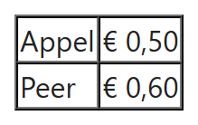
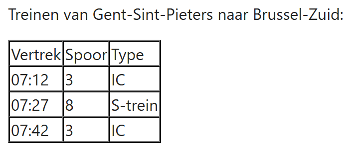

## Theorie

De uitgebreide uitleg vind je op [https://rogiervdl.github.io/HTML-course/04_tabellen.html#basisversie-met-table-tr-en-td](https://rogiervdl.github.io/HTML-course/04_tabellen.html#basisversie-met-table-tr-en-td)

Een tabel maak je met `<table>`. Daarbinnen is elke rij een `<tr>` (*table row*) en elke cel in die rij een `<td>` (*table data*). Het aantal cellen per rij bepaalt dus het aantal kolommen. Gebruik een tabel **enkel voor tabulaire data**: gegevens waarvan de betekenis afhangt van de rij én de kolom. Nooit voor layout!

```html
<table border="1" cellspacing="0">
   <!-- eerste rij -->
   <tr>
      <td>Appel</td>
      <td>&euro; 0,50</td>
   </tr>
   <!-- tweede rij -->
   <tr>
      <td>Peer</td>
      <td>&euro; 0,60</td>
   </tr>
</table>
```

Resultaat:



**Opgelet:** de `<table>`-attributen `border="1"` en `cellspacing="0"` staan hier enkel om de randen van de tabel zichtbaar te maken. Ze zijn **verouderd** en later vervangen we ze door CSS.

## Opdracht

Maak een tabel naar voorbeeld van de screenshot.

### Screenshot



### Teksten

Alle teksten van de tabel staan hieronder, zonder opmaak, zodat je ze kan kopiëren. Elke regel is één rij.

```
Vertrek   Spoor   Type
07:12   3   IC
07:27   8   S-trein
07:42   3   IC
```
