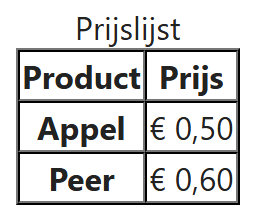
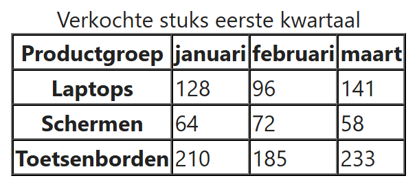

## Theorie

`<caption>` geeft de tabel een bijschrift en staat altijd als **eerste kind** van `<table>`. Een titelcel is geen `<td>` maar een `<th>` (*table header*); browsers tonen die vet en gecentreerd. Met `scope` zeg je erbij wat de kop beschrijft: `scope="col"` voor een kolomtitel, `scope="row"` voor een rijtitel. Screenreaders lezen bij elke cel de bijhorende koppen voor, zodat een blinde gebruiker weet waar hij zit.

```html
<table border="1" cellspacing="0">
   <caption>Prijslijst</caption><!-- bijschrift -->
   <tr>
      <th scope="col">Product</th><!-- kolomkop -->
      <th scope="col">Prijs</th><!-- kolomkop -->
   </tr>
   <tr>
      <th scope="row">Appel</th><!-- rijkop -->
      <td>&euro; 0,50</td>
   </tr>
   <tr>
      <th scope="row">Peer</th>
      <td>&euro; 0,60</td>
   </tr>
</table>
```

Resultaat:



**Opgelet:** de `<table>`-attributen `border="1"` en `cellspacing="0"` staan hier enkel om de randen van de tabel zichtbaar te maken. Ze zijn **verouderd** en we vervangen ze later door CSS.

## Opdracht

Maak een tabel naar voorbeeld van deze screenshot:



Denk ook aan de `scope`-attributen: die zie je niet op de screenshot.
