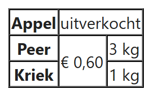
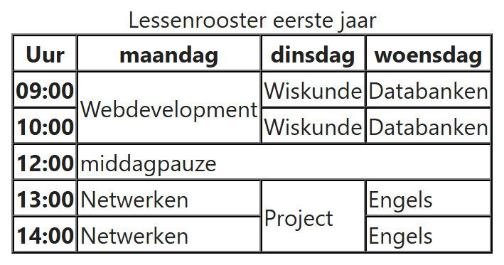

## Theorie

Met `colspan="3"` loopt een cel over drie kolommen, met `rowspan="2"` over twee rijen. Elke cel die je zo laat meelopen, **verwijder je in de rijen of kolommen ernaast**: anders staan er te veel cellen in de rij en klopt de tabel niet meer. Tel dus per rij hoeveel kolommen ze werkelijk inneemt, de samengevoegde cellen meegerekend.

```html
<table border="1" cellspacing="0">
   <tr>
      <th scope="row">Appel</th>
      <td colspan="2">uitverkocht</td><!-- neemt twee kolommen in -->
   </tr>
   <tr>
      <th scope="row">Peer</th>
      <td rowspan="2">&euro; 0,60</td><!-- loopt door in de volgende rij -->
      <td>3 kg</td>
   </tr>
   <tr>
      <th scope="row">Kriek</th>
      <!-- hier geen cel: de prijs hierboven staat er al -->
      <td>1 kg</td>
   </tr>
</table>
```

Resultaat:



**Opgelet:** de `<table>`-attributen `border="1"` en `cellspacing="0"` staan hier enkel om de randen van de tabel zichtbaar te maken. Ze zijn **verouderd** en we vervangen ze later door CSS.

## Opdracht

Maak een tabel naar voorbeeld van de screenshot. Tel per rij hoeveel kolommen ze inneemt: overal moeten het er vier zijn.

### Screenshot



### Teksten

Alle teksten van de tabel staan hieronder, zonder opmaak, zodat je ze kan kopiëren. Elke regel is één rij; de eerste regel is het bijschrift. Een cel die over meerdere rijen loopt, staat enkel in de rij waar ze begint.

```
Lessenrooster eerste jaar

Uur   maandag   dinsdag   woensdag
09:00   Webdevelopment   Wiskunde   Databanken
10:00   Wiskunde   Databanken
12:00   middagpauze
13:00   Netwerken   Project   Engels
14:00   Netwerken   Engels
```
