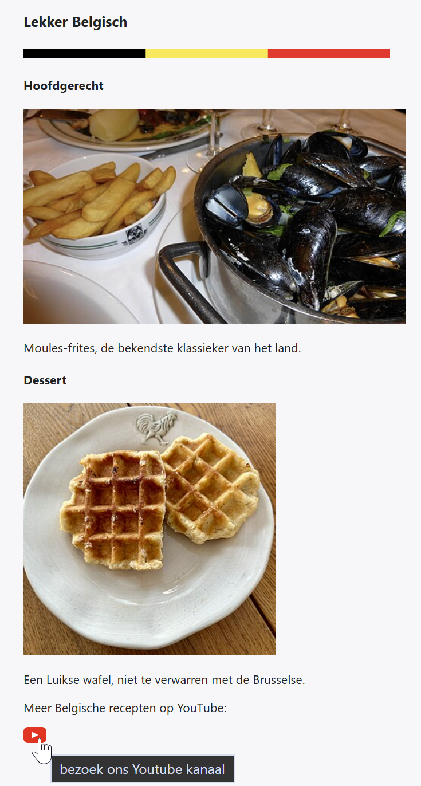

## Theorie

De uitgebreide uitleg vind je op [https://rogiervdl.github.io/HTML-course/05_media.html#img-](https://rogiervdl.github.io/HTML-course/05_media.html#img-)

Een afbeelding voeg je toe met ``. In `src` staat het pad naar het bestand: **relatief** (`img/kust.jpg`) voor een afbeelding op je eigen site, **absoluut** (`https://...`) voor een afbeelding die elders staat (dit heet *hot linken*: doe dit niet zonder toestemming).

Het `alt` attribuut is **verplicht**: het beschrijft de afbeelding voor wie ze niet ziet en voor zoekmachines. Geef een zinvolle beschrijving, nooit de bestandsnaam. Een **decoratieve** afbeelding voegt geen informatie toe en krijgt `alt=""`: een screenreader slaat ze dan over.

Staat de afbeelding **in een link**, dan wordt haar `alt` de linktekst. Beschrijf daar dus waar de link naartoe gaat, niet hoe de afbeelding eruitziet.

```html

<!-- decoratief: geen beschrijving -->
<a href="https://www.mijnbedrijf.com">
   <!-- de alt is de linktekst -->
</a>
```

## Opdracht

Maak onderstaande pagina. Gebruik voor de titels `<h3>` en `<h4>`.

1. de decoratieve band heet `vlagband.png` en staat in een submap `img/`
2. foto hoofdgerecht heet `moules-frites.jpg` en staat in een submap `img/gerechten/`
3. foto dessert is te vinden op *https://upload.wikimedia.org/wikipedia/commons/thumb/5/50/Li%C3%A8ge_waffles_on_a_plate.jpg/330px-Li%C3%A8ge_waffles_on_a_plate.jpg*
4. link onderaan een youtube icoon `img/youtube.png` naar *https://www.youtube.com/c/NJAMhetKOOKKANAAL*
5. geef elke afbeelding een alt-attribuut; vul enkel in waar nodig

### Screenshot



### Teksten

Alle teksten van de pagina staan hieronder, zonder opmaak, zodat je ze kan kopiëren. De laatste regel is de tooltip die bij het YouTube-icoon verschijnt.

```
Lekker Belgisch

Hoofdgerecht

Moules-frites, de bekendste klassieker van het land.

Dessert

Een Luikse wafel, niet te verwarren met de Brusselse.

Meer Belgische recepten op YouTube:

bezoek ons Youtube kanaal
```
