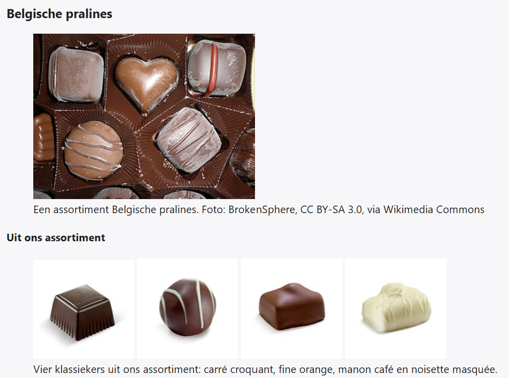

## Theorie

De uitgebreide uitleg vind je op [https://rogiervdl.github.io/HTML-course/05_media.html#figure-en-figcaption](https://rogiervdl.github.io/HTML-course/05_media.html#figure-en-figcaption)

Hoort er een bijschrift bij een afbeelding, zet dan beide samen in een `<figure>`, en het bijschrift zelf in `<figcaption>`. Gebruik nooit een losse `<p>` als bijschrift: dan is er geen enkel verband tussen de tekst en de afbeelding. Het bijschrift is ook de plaats voor een **bronvermelding** bij een foto die je van iemand anders overneemt.

```html
<figure>
   
   <figcaption>Ons nieuwe kantoor in Gent</figcaption>
</figure>
```

Een `<figure>` mag ook **meerdere afbeeldingen** bevatten die samen één geheel vormen, met één gezamenlijk `<figcaption>`. Zo maak je van een reeks foto's één galerij in plaats van losse afbeeldingen.

```html
<figure>
   
   
   <figcaption>Ons kantoor in beide seizoenen</figcaption><!-- één bijschrift voor beide -->
</figure>
```

## Opdracht

Zet er bijschriften onder naar voorbeeld van de screenshot.

## Screenshot


