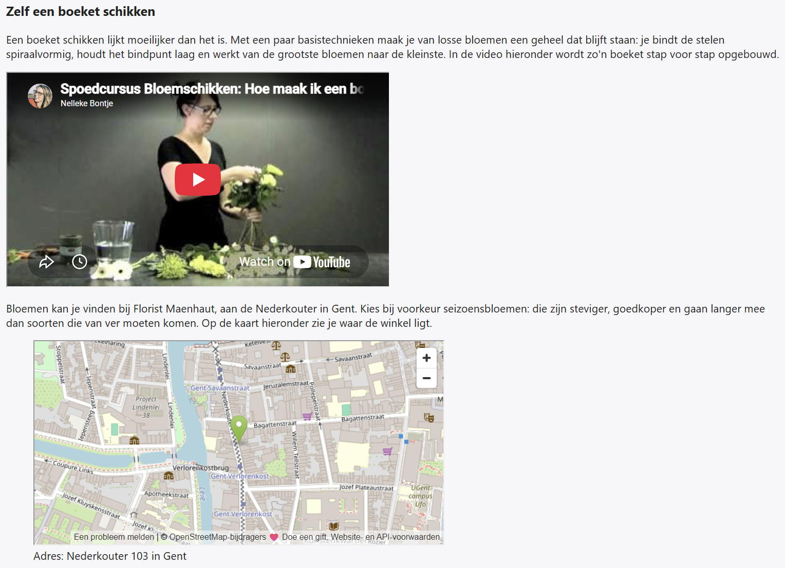

## Theorie

De uitgebreide uitleg vind je op [https://rogiervdl.github.io/HTML-course/05_media.html#embedding](https://rogiervdl.github.io/HTML-course/05_media.html#embedding)

Externe inhoud (een YouTube-video, een kaart…) sluit je in met een `<iframe>`: dat toont een volledige andere pagina in een kader binnen de jouwe. Die code schrijf je nooit zelf: je kopieert ze bij de bron, op YouTube via *Delen → Insluiten*, op OpenStreetMap via *Delen → HTML* en op Google Maps via *Delen → Kaart insluiten*. Met `width` en `height` stel je de grootte van het kader in. Het attribuut `title` is **verplicht**: het zegt wat er in het kader zit, net zoals `alt` dat doet bij een afbeelding.

*Let op: de code aangeleverd door Youtube, Google of OpenStreetMap bevat vaak veel overbodige en/of foutieve attributen. Gooi ze er gerust uit.*

```html
<iframe
   src="https://www.youtube.com/embed/aqz-KE-bpKQ"
   title="Big Buck Bunny, een korte animatiefilm"
   width="560" height="315">
</iframe>
```

Hoort er een bijschrift bij, dan zet je het geheel in een `<figure>`.

```html
<figure>
   <iframe
      src="https://www.youtube.com/embed/aqz-KE-bpKQ"
      title="Big Buck Bunny, een korte animatiefilm"
      width="560" height="315">
   </iframe>
   <figcaption>Big Buck Bunny – Blender Foundation</figcaption>
</figure>
```

## Opdracht

Pas onderstaande pagina aan naar voorbeeld van de screenshot.

1. zoek zelf een video over bloemschikken op Youtube
2. gebruik voor de kaart OpenStreetMap (zoek het adres van de screenshot op); zet het adres in een onderschrift

## Screenshot


