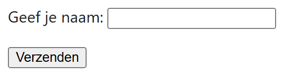
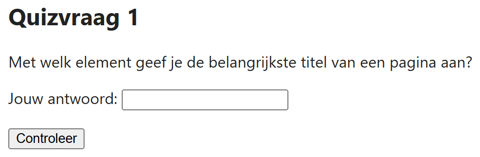

## Theorie

Alle velden van een formulier staan samen in een `<form>`. Een tekstveld maak je met `<input type="text">`. Elk veld krijgt een `name`: onder die naam wordt de ingevulde waarde straks verstuurd.

Bij elk veld hoort een `<label>`, dat je met `for` koppelt aan de `id` van het veld. Dat is **geen opsmuk**: klikt de gebruiker op het label, dan springt de cursor in het veld, en een screenreader leest het label voor zodra het veld focus krijgt. Een veld zonder label is voor een blinde gebruiker een leeg vakje.

Met `<button type="submit">` verstuur je het formulier. Waar de gegevens naartoe gaan, bepaal je met de attributen `action` en `method` op het `<form>`.

```html
<form>
   <p>
      <label for="naam">Geef je naam:</label><!-- for verwijst naar de id -->
      <input type="text" id="naam" name="naam">
   </p>
   <p>
      <button type="submit">Verzenden</button>
   </p>
</form>
```

Resultaat:



## Opdracht

Maak onderstaand formulier naar voorbeeld van de screenshot.

## Screenshot


