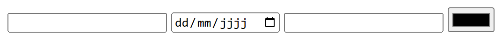
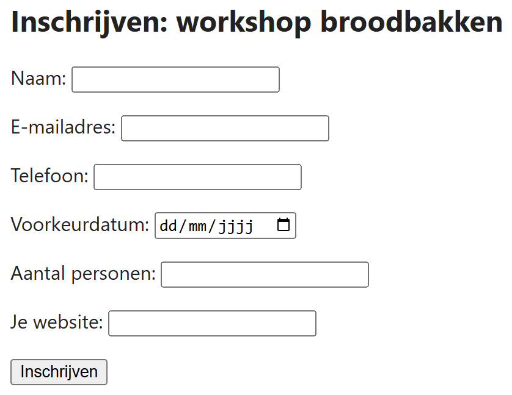

## Theorie

Het attribuut `type` bepaalt drie dingen tegelijk: hoe het veld eruitziet, welk toetsenbord op een gsm verschijnt, en welke controle de browser zelf uitvoert. Bij `type="email"` kijkt de browser na of er een apenstaartje in staat en krijgt de gebruiker op zijn gsm een toetsenbord met een `@`-toets; bij `type="date"` verschijnt een kalender. Het juiste type kiezen scheelt dus werk voor jou én voor je bezoeker.

Er zijn er een twintigtal. De meest gebruikte zijn `text`, `email`, `tel`, `url`, `number`, `date`, `time`, `password`, `color`, `range` en `file`. Een volledig overzicht met alle types naast elkaar vind je in het [totaalformulier in de cursus](https://rogiervdl.github.io/HTML-course/06_formulieren.html#totaalformulier).

```html
<input type="email" id="mail" name="mail"><!-- controleert op een @ -->
<input type="date" id="geboren" name="geboren"><!-- toont een kalender -->
<input type="number" id="aantal" name="aantal"><!-- enkel cijfers, met pijltjes -->
<input type="color" id="kleur" name="kleur"><!-- opent een kleurenkiezer -->
```

Resultaat:



## Opdracht

Maak het inschrijvingsformulier hieronder naar voorbeeld van de screenshot. Kies bij elk veld het type dat bij het gevraagde gegeven past.

## Screenshot


