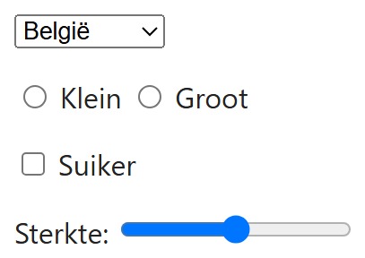
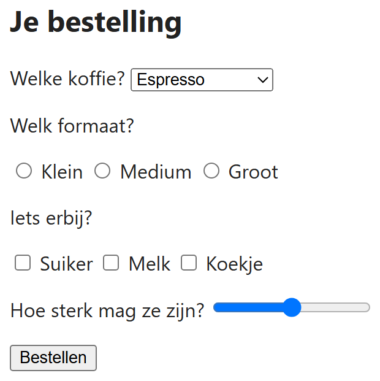

## Theorie

- **Keuzelijst** – `<select>` met een `<option>` per keuze: één antwoord uit een lange lijst, en het neemt weinig plaats in
- **Radioknoppen** – `<input type="radio">`: één antwoord uit enkele opties, allemaal tegelijk zichtbaar
- **Checkboxes** – `<input type="checkbox">`: geen, één of meerdere antwoorden
- **Schuifbalk** – `<input type="range">`: een waarde tussen een minimum en een maximum, wanneer het gevoel belangrijker is dan het exacte getal

Radioknoppen die bij elkaar horen krijgen **dezelfde `name`**: daardoor sluiten ze elkaar uit en kan er maar één aanstaan. Elk veld krijgt wel een eigen `id` (voor het label) en een eigen `value` (wat er verstuurd wordt). Vergeet je de gelijke `name`, dan kan de gebruiker ze allemaal tegelijk aanvinken.

```html
<p>
   <select id="land" name="land">
      <option value="be">België</option>
      <option value="nl">Nederland</option>
   </select>
</p>

<p>
   <input type="radio" id="klein" name="formaat" value="klein"><!-- zelfde name -->
   <label for="klein">Klein</label>
   <input type="radio" id="groot" name="formaat" value="groot"><!-- zelfde name -->
   <label for="groot">Groot</label>
</p>

<p>
   <input type="checkbox" id="suiker" name="extra" value="suiker">
   <label for="suiker">Suiker</label>
</p>

<p>
   <label for="sterkte">Sterkte:</label>
   <input type="range" id="sterkte" name="sterkte" min="1" max="5"><!-- schuifbalk -->
</p>
```

Resultaat:



## Opdracht

Maak het bestelformulier hieronder naar voorbeeld van de screenshot. Kies per vraag het element dat erbij past.

## Screenshot


