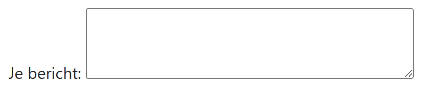
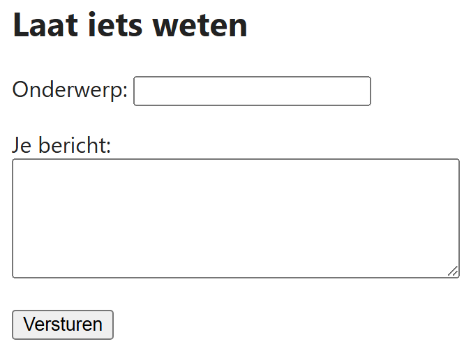

## Theorie

Voor tekst van meer dan één regel gebruik je `<textarea>`. Anders dan bij `<input>` is dat **geen leeg element**: het heeft een begin- en een eindtag. Wat je ertussen zet, staat al ingevuld in het veld, dus laat je het meestal leeg. Met `rows` en `cols` bepaal je hoeveel regels en tekens er zichtbaar zijn; de gebruiker kan altijd meer typen.

```html
<label for="bericht">Je bericht:</label>
<textarea id="bericht" name="bericht" rows="4" cols="40"></textarea><!-- laat leeg -->
```

Resultaat:



## Opdracht

Maak het contactformulier hieronder naar voorbeeld van de screenshot.

## Screenshot


