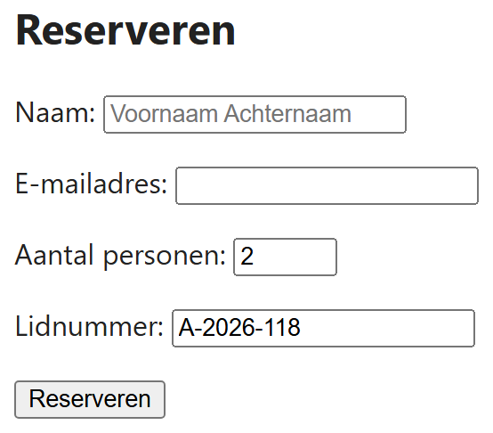

## Theorie

- `required` – het formulier vertrekt niet zolang dit veld leeg is
- `placeholder` – een grijze hint in het lege veld; **geen vervanging voor een label**, want de tekst verdwijnt zodra je typt
- `value` – de waarde die al ingevuld staat
- `min`, `max` en `step` – grenzen voor getallen en datums
- `maxlength` – het maximale aantal tekens
- `readonly` en `disabled` – het veld is niet aanpasbaar; een `disabled` veld wordt bovendien niet meeverstuurd

```html
<input type="text" id="naam" name="naam" placeholder="Voornaam Achternaam" required>
<input type="number" id="aantal" name="aantal" min="1" max="10" value="2">
```

## Opdracht

Het formulier hieronder werkt, maar laat te veel toe. Vul de attributen aan naar voorbeeld van de screenshot: naam en e-mailadres zijn verplicht, bij de naam staat een hint in het veld, het aantal personen ligt tussen 1 en 8 en staat standaard op 2, en het lidnummer is ingevuld maar mag niet gewijzigd worden.

## Screenshot


