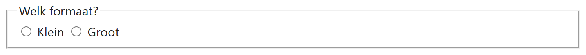
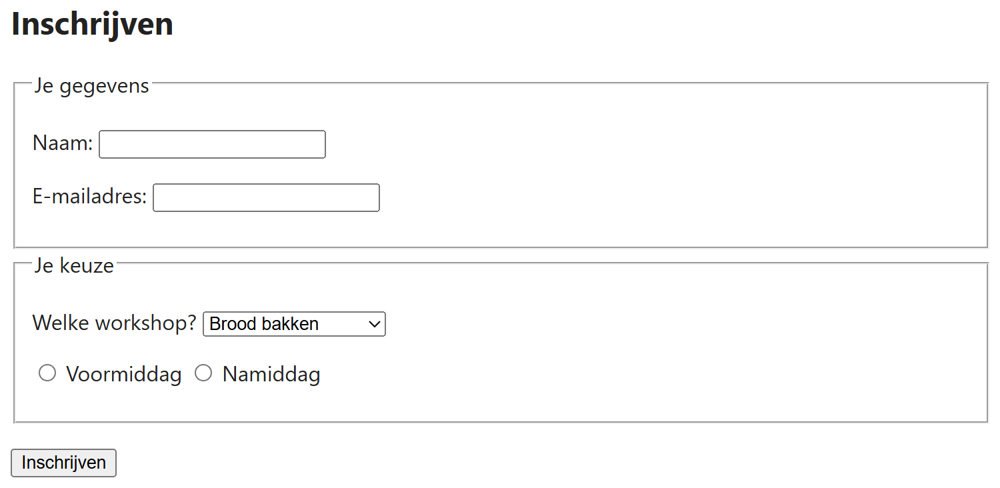

## Theorie

Met `<fieldset>` groepeer je velden die bij elkaar horen; de browser tekent er een kader omheen. De titel van die groep zet je in een `<legend>`, en dat moet het **eerste kind** van de fieldset zijn.

Bij een groep radioknoppen is dit meer dan opsmuk: de losse labels zeggen enkel "klein" of "groot", terwijl de legend vertelt waar de knoppen samen over gaan. Een screenreader leest die legend voor bij elke knop van de groep.

```html
<fieldset>
   <legend>Welk formaat?</legend><!-- altijd als eerste -->
   <input type="radio" id="klein" name="formaat" value="klein">
   <label for="klein">Klein</label>
   <input type="radio" id="groot" name="formaat" value="groot">
   <label for="groot">Groot</label>
</fieldset>
```

Resultaat:



## Opdracht

Het formulier hieronder is één lange rij velden. Deel het op naar voorbeeld van de screenshot: een groep met de gegevens van de deelnemer en een groep met de keuzes voor de workshop.

## Screenshot


