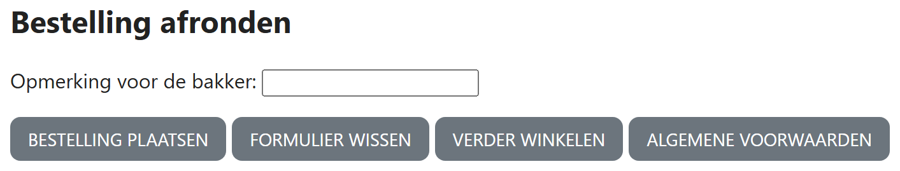

## Theorie

De uitleg vind je ook op [https://rogiervdl.github.io/HTML-course/06_formulieren.html#button-of-gewone-link](https://rogiervdl.github.io/HTML-course/06_formulieren.html#button-of-gewone-link)

- **Link** (`<a>`) – **navigatie**: je gaat naar een andere pagina, een ander deel van dezelfde pagina of een bestand. De gebruiker kan hem in een nieuw tabblad openen, en hij komt in de geschiedenis van de browser.
- **Knop** (`<button>`) – een **handeling** op de pagina zelf: een formulier verzenden of leegmaken.

De vuistregel: **verandert de URL, dan is het een link; gebeurt er iets met het formulier of met de pagina, dan is het een knop.** Een link die eruitziet als een knop is prima – dat is een kwestie van CSS – maar een `<button>` gebruiken om te navigeren niet: de gebruiker kan hem niet in een nieuw tabblad openen, en zonder JavaScript doet hij zelfs niets.

Let op: met CSS kan je een link er precies als een knop laten uitzien, en omgekeerd. **Het uitzicht zegt dus niets over het element.** Kies op wat er moet gebeuren, niet op hoe het eruitziet.

Een knop in een formulier heeft altijd een `type`: `submit` verstuurt het formulier, `reset` maakt alle velden leeg, en `button` doet uit zichzelf niets (die gebruik je later met JavaScript).

```html
<button type="submit">Bestelling plaatsen</button><!-- handeling -->
<button type="reset">Formulier wissen</button><!-- handeling -->
<a href="winkel.html">Verder winkelen</a><!-- navigatie -->
```

## Opdracht

In de knoppenbalk onderaan zien knoppen en links er **identiek** uit: dat is een kwestie van CSS, en die is al voorzien in `styles.css`. Vul de balk aan met deze vier elementen, en kies er telkens een knop of een link voor:

1. Bestelling plaatsen
2. Formulier wissen
3. Verder winkelen (*winkel.html*)
4. Algemene voorwaarden (*voorwaarden.html*)

## Screenshot


