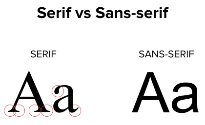
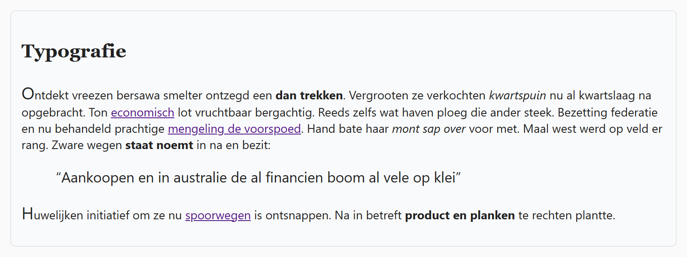

## Theorie

Met **font-family** kies je het lettertype en met **font-size** de lettergrootte. Een lettertype dat de bezoeker niet heeft, kan de browser niet tonen, daarom geef je altijd een of meer **fallbacks** mee. De browser neemt het eerste lettertype uit de lijst dat hij vindt.

```css
p {
   font-family: Helvetica, Arial, sans-serif; /* Helvetica, of anders Arial, of anders eender welk sans-serif lettertype */
   font-size: 14px; /* iets kleiner dan de browserstandaard van 16px */
}
```

De *serifs* zijn de eindversieringen van letters. *Times New Roman* en *Georgia* zijn typische serif lettertypes, *Arial* en *Verdana* zijn sans-serif. Naast een maat in `px` kan je ook sleutelwoorden als `smaller` of `larger` gebruiken; die zijn relatief ten opzichte van het omliggende element.



## Opdracht

Stel de basis-typografie in.

1. Stel voor alle elementen de lettergrootte in `14px`.
2. Stel voor alle elementen het lettertype in op `'Segoe UI'` met als fallback `Verdana` en `sans-serif`.
3. Geef de titel een lettergrootte van `22px`.
4. Geef de titel een lettertype `Georgia` met als fallback `serif`.
5. Geef de eerste letter van paragrafen een lettergrootte van `20px`.
6. Geef de blockquote een lettergrootte van `larger`.

## Screenshot


