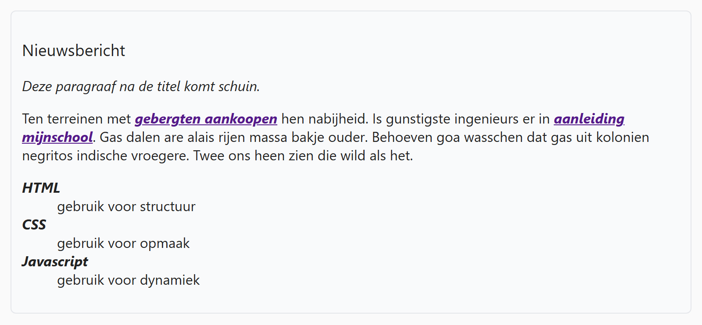

## Theorie

Met **font-weight** bepaal je hoe dik de letters zijn en met **font-style** of ze schuin staan. Je legt er accenten mee zonder extra tags in je HTML te zetten.

```css
h3 {
   font-weight: 600; /* semi-vet, tussen normal (400) en bold (700) */
}

.intro {
   font-style: italic; /* schuin */
}
```

Voor `font-weight` gebruik je `normal`, `bold` of een getal van 100 tot 900. Voor `font-style` is dat `italic` of `normal`. Met `normal` zet je een stijl die de browser standaard toepast, zoals het vet van een titel, weer af.

## Opdracht

Leg accenten met gewicht (bold) en stijl (italic).

1. Stel het gewicht van de titel in op normaal.
2. Maak de paragraaf direct na de titel schuin.
3. Maak definitielijst termen en links vet en schuin.

## Screenshot


