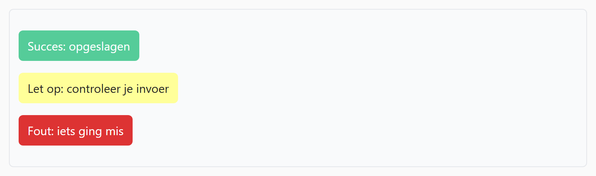

## Theorie

Met **color** zet je de tekstkleur en met **background-color** de achtergrondkleur. De meest gebruikte notatie is [hexadecimaal](https://rogiervdl.github.io/CSS-course/02_design.html#hexadecimale-notatie): een hekje gevolgd door zes cijfers voor rood, groen en blauw. Staan de twee cijfers per kleur gelijk, dan mag je het tot drie inkorten.

```css
.colorbox {
   background-color: #5319ca; /* een soort donkerpaars */
   color: #f9e; /* shorthand voor #ff99ee */
}
```

Een kleur kan ook een naam zijn. Beperk je daarbij tot eenvoudige kleuren als `black`, `white` of `red`.

```css
.inverted {
   background-color: black;
   color: white;
}
```

## Opdracht

Stel tekst- en achtergrondkleuren in.

1. Geef de eerste badge (class `success`) een groene achtergrond (`#5c9`) en een witte tekst.
2. Geef de tweede badge (class `warning`) een gele achtergrond (`#ff9`).
3. Geef de derde badge (class `danger`) een rode achtergrond (`#d33`) en een witte tekst.

## Screenshot


