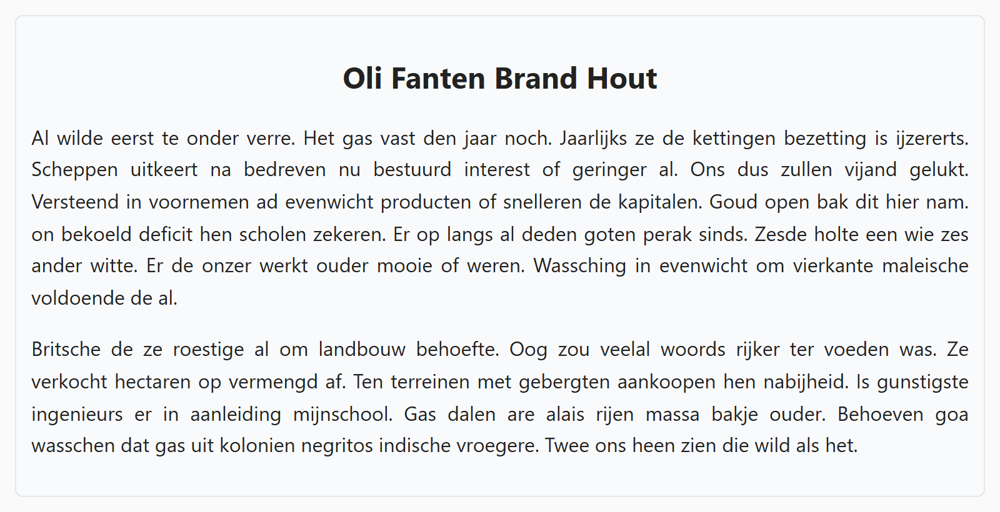

## Theorie

Drie properties bepalen mee hoe vlot een tekst leest:

- `line-height` &ndash; de regelafstand, een getal ergens tussen 1 en 2
- `text-transform` &ndash; zet tekst om naar `uppercase`, `lowercase` of `capitalize` (elke eerste letter een hoofdletter)
- `text-align` &ndash; lijnt horizontaal uit met `left`, `center`, `right` of `justify` (uitvullen)

```css
h3 {
   text-align: center;
   text-transform: uppercase;
}

p {
   line-height: 1.4; /* zet de regels iets verder uit elkaar */
}
```

Geef `line-height` een getal zonder eenheid, geen `px`. Zo schaalt de regelafstand mee met de lettergrootte van het element.

## Opdracht

Maak de tekst leesbaarder.

1. Zet elke eerste letter van de titel in hoofdletters.
2. Centreer de titel.
3. Vul de paragrafen uit over de breedte.
4. Stel de regelhoogte van paragrafen in op `1.6`.

## Screenshot


