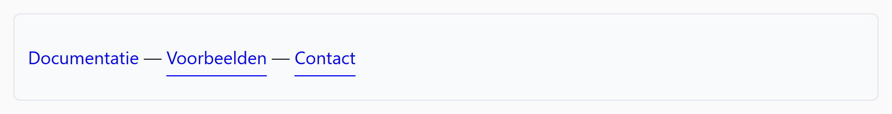

## Theorie

Een link krijgt van de browser standaard een lijntje onder zich. Met **text-decoration** zet je dat aan (`underline`) of uit (`none`), en met **text-underline-offset** bepaal je hoe ver het lijntje onder de tekst staat.

```css
a {
   text-decoration: none; /* standaard geen lijntje */
}

a:hover {
   text-decoration: underline; /* lijntje bij hover */
   text-underline-offset: 3px; /* 3px lager, dat oogt netter */
}
```

Haal je de onderlijning weg, zorg dan dat de link toch nog herkenbaar blijft, bijvoorbeeld door een afwijkende kleur.

## Opdracht

Stel de lijntjes onder de links in.

1. Stel de afstand tussen link en lijntje in op `10px`.
2. Verwijder lijntjes van links bij hover.

## Screenshot


Met de muis boven de eerste link:


