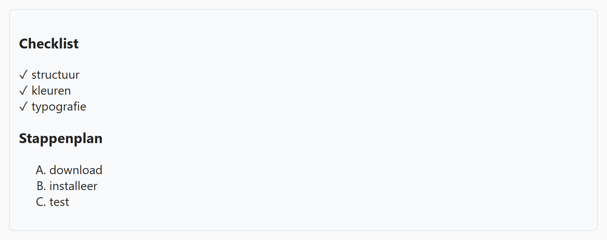

## Theorie

Met **list-style** kies je het type opsommingsteken van een lijst: `disc`, `square`, `decimal`, `upper-latin`... of `none` om ze weg te halen. Browsers geven een lijst ook standaard een inspringing; die haal je weg met **padding-left**.

```css
ul {
   list-style: none; /* geen bullets */
   padding-left: 0; /* ook de standaard inspringing weg */
}
```

Wil je zelf een bulletje of icoon plaatsen, dan doe je dat met `::before`. Zet in dat geval eerst `list-style: none`, anders staan er twee tekens voor elk item.

```css
li::before {
   content: '★ ';
}
```

## Opdracht

Kies bullets/nummering.

1. Haal de bullets bij de checklist weg.
2. Stel de linkerpadding van de checklist in op `0`.
3. Zet voor elke `li` van de checklist het '✓ ' karakter (tip: gebruik de `::before` pseudo selector).
4. Geef de stappenplan lijst bullets van het type `upper-latin`.

## Screenshot


