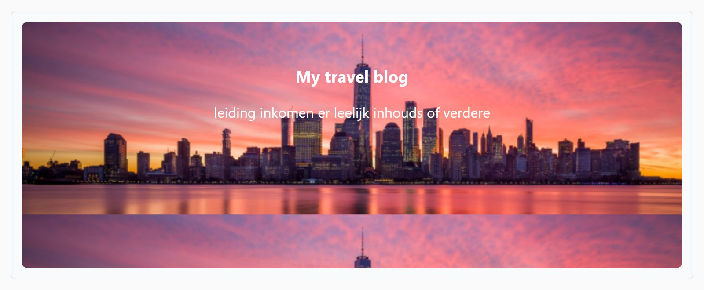

## Theorie

Met **background-image** zet je een afbeelding achter de inhoud van een element. Het pad geef je mee met `url(...)`, en dat pad is relatief ten opzichte van het **CSS-bestand**, niet ten opzichte van de HTML.

```css
.banner {
   background-color: #eee; /* fallback, zichtbaar zolang de afbeelding niet geladen is */
   background-image: url(../img/bg.png);
}
```

Geef er altijd een **background-color** bij. Die zie je zolang de afbeelding nog laadt of als ze niet gevonden wordt, en ze zorgt ervoor dat de tekst intussen leesbaar blijft.

## Opdracht

Stel een achtergrondafbeelding in.

1. Geef de banner een violet achtergrondkleur (`#606`).
2. Stel op de banner de afbeelding `skyline.jpg` uit de `img` map als achtergrond in.

## Screenshot


