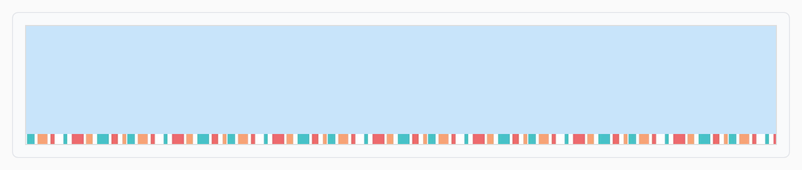

## Theorie

Een achtergrondafbeelding die kleiner is dan het element wordt standaard **herhaald** tot het element gevuld is. Met **background-repeat** stuur je dat bij:

- `repeat` &ndash; herhaal in beide richtingen (de standaardwaarde)
- `repeat-x` &ndash; herhaal enkel horizontaal
- `repeat-y` &ndash; herhaal enkel verticaal
- `no-repeat` &ndash; toon de afbeelding één keer

```css
.wall {
   background-image: url(../img/kleurstrip.png);
   background-position: right top; /* begin rechtsboven */
   background-repeat: repeat-y; /* en herhaal naar onder */
}
```

Combineer dit met `background-size` en `background-position`: die bepalen samen hoe groot één tegel is en waar de rij begint.

## Opdracht

Stel de herhaling van een achtergrondafbeelding in.

1. Geef het element met class `bottomstrip` een lichtblauwe achtergrondkleur (`#C8E4FA`).
2. Stel de achtergrondafbeelding in op `colorstrip.webp` uit de `img` map.
3. Laat het enkel in de x-richting herhalen.
4. Positioneer het (links)onder.
5. Stel de afmeting van de achtergrond in op 100px horizontaal en 10px verticaal.

## Screenshot


