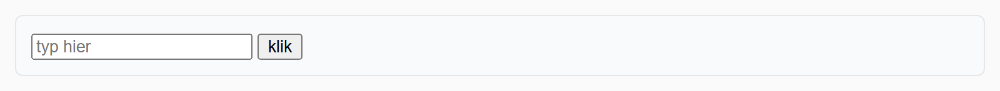
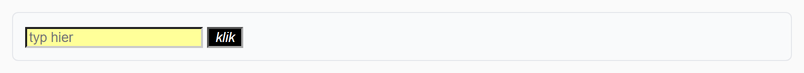

## Theorie

Een **pseudo class** selecteert een element op basis van zijn **toestand**. Je schrijft ze met een dubbelpunt achter de selector. De belangrijkste drie zag je al bij de selectoren:

- `:hover` &ndash; de muis staat boven het element
- `:active` &ndash; er wordt op het element geklikt
- `:focus` &ndash; het element is geselecteerd, bijvoorbeeld een tekstvak waarin je klikt

```css
a:hover {
   color: #930; /* andere linkkleur bij hover */
}

input:focus {
   background-color: #9f9; /* lichtgroene achtergrond bij focus */
}
```

De gewone stijlregel blijft gelden; in de pseudo class zet je enkel wat er verandert. Dit is een herhalingsoefening: gebruik ze om te controleren of je de interactiestaten uit de selectorenreeks nog vlot toepast.

## Opdracht

Pas styling toe op interactiestaten.

1. Bij hover op de knop: zwarte achtergrond met witte tekst.
2. Bij active op de knop: maak de tekst schuin.
3. Bij focus op het tekstveld: lichtgele achtergrond (`#ff9`).

## Screenshot



De drie toestanden samen: de cursor staat in het tekstveld, en de knop wordt ingedrukt:


