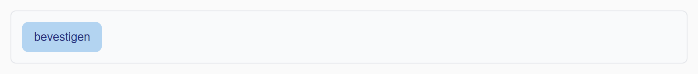
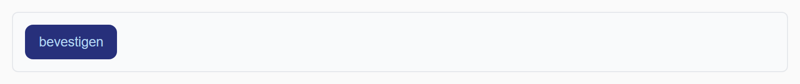

## Theorie

Zonder meer springt een hover-effect meteen van de ene kleur naar de andere. Met **transition** laat je die verandering vloeiend verlopen. Je zet de transition op de **gewone** stijlregel, niet op de `:hover` regel, zodat de overgang in beide richtingen werkt.

```css
a {
   transition: background-color 0.4s, color 0.3s; /* welke property, en hoe lang */
}

a:hover {
   background-color: #16b;
   color: #f94;
}
```

Per property geef je een duur mee, gescheiden door een komma. Houd het kort: 0,2 tot 0,5 seconde voelt vlot aan, alles daarboven laat de pagina traag lijken.

## Opdracht

Maak het hover-effect vloeiend met transities.

1. Geef de knop een lichtblauwe achtergrond (`#b3d4f1`) en donkerblauwe tekst (`#27307b`).
2. Bij hover: verwissel tekstkleur en achtergrondkleur.
3. Maak dit vloeiend met een transitie van 0.7s op de achtergrondkleur en 0.3s op de tekstkleur.

## Screenshot



Met de muis boven de knop:


