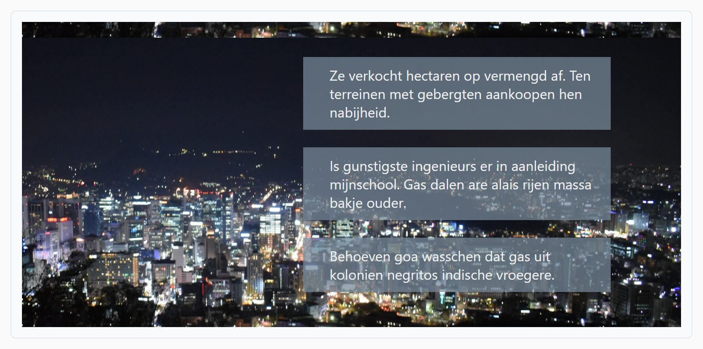

## Theorie

Rond elk element zitten twee soorten ruimte: **padding** is de ruimte *binnen* het element, tussen de rand en de inhoud; **margin** is de ruimte *buiten* het element, tussen dit element en zijn buren. Een achtergrondkleur loopt wel door in de padding, maar niet in de margin.

```css
aside {
   padding: 15px; /* overal 15px */
}

.box {
   padding: 10px 20px; /* boven/onder 10px, links/rechts 20px */
}

img.visual {
   margin: 0 10px 10px 0; /* boven, rechts, onder, links (met de klok mee) */
}
```

Je kan ook één zijde apart zetten met `padding-left`, `margin-bottom`... Geef je `margin-left: auto`, dan duwt de browser het element naar rechts.

## Opdracht

Beheer de ruimte binnen en buiten elementen.

1. Geef de header een padding van `40px` verticaal, en `80px` horizontaal.
2. Geef de header boxes in één regel een padding van overal `10px`, behalve links, daar is de padding `30px`.
3. Geef de header boxes een ondermarge van `20px`.
4. Geef de laatste header box een ondermarge van `0` (tip: gebruik `:last-child`).
5. Extra: plaats de header boxes rechts door de linkermarge de waarde `auto` te geven.

## Screenshot


