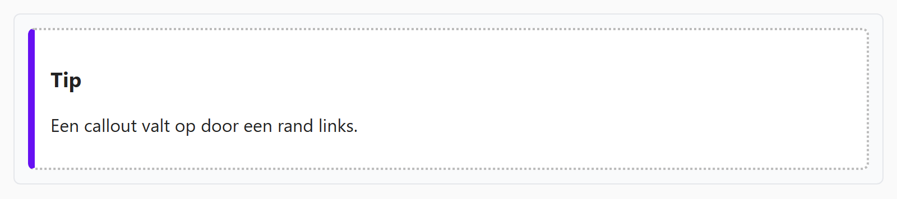

## Theorie

Met **border** teken je een rand rond een element. Je geeft in één keer de breedte, de stijl en de kleur mee.

```css
.photo {
   border: 4px solid #ddd; /* 4px breed, vol, lichtgrijs */
}

.product {
   border-bottom: 2px dashed #900; /* enkel onderaan, gestreept, donkerrood */
}
```

Mogelijke stijlen zijn onder meer `solid`, `dashed` en `dotted`. Met `border-top`, `border-right`, `border-bottom` en `border-left` zet je één zijde apart. Zet je eerst `border` en daarna `border-left`, dan overschrijft die laatste enkel de linkerzijde.

## Opdracht

Gebruik een rand om de callout af te bakenen.

1. Geef de callout een volle linkerrand van 6px donkerpaars (`#6610f2`).
2. Geef de callout daarnaast een dunne 2px gestippelde donkergrijze (`#bbb`) rand rondom.

## Screenshot


