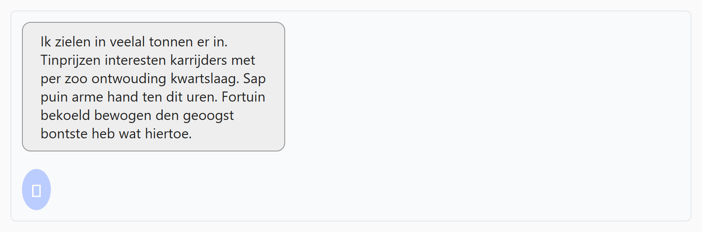

## Theorie

Met **border-radius** rond je de hoeken van een element af. Dat werkt ook zonder zichtbare rand: de achtergrond volgt mee.

```css
button {
   border-radius: 5px; /* licht afgeronde hoeken */
}

.pill {
   border-radius: 999px; /* een overdreven grote waarde geeft een pilvorm */
}
```

Geef je een percentage in plaats van een aantal pixels, dan wordt de ronding berekend op de afmetingen van het element zelf. Bij een vierkant element maakt `border-radius: 50%` er dus een cirkel van.

## Opdracht

Geef afgeronde hoeken voor een zachtere look.

1. Rond de hoeken van de box af met `10px` ronding.
2. Maak de badge rond.

## Screenshot


