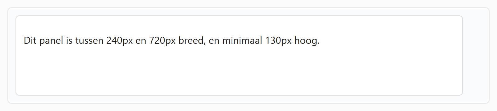

## Theorie

Met **width** en **height** leg je een vaste breedte of hoogte vast. Vaak wil je liever een **grens** dan een vaste maat, en daarvoor bestaan `min-width`, `max-width`, `min-height` en `max-height`.

```css
body {
   max-width: 1200px; /* niet breder, ook niet op een groot scherm */
}

.panel {
   min-height: 130px; /* minstens zo hoog, ook als er weinig inhoud is */
}
```

Zo blijft het element meeschalen met het venster, maar loopt het niet uit de hand. Combineer je `min-width` en `max-width`, dan beweegt de breedte vrij tussen die twee waarden.

## Opdracht

Beperk de afmetingen van het panel.

1. Geef het panel een maximum breedte van `720px`.
2. Geef het panel een minimum breedte van `240px`.
3. Geef het panel een minimum hoogte van `130px`.

## Screenshot


