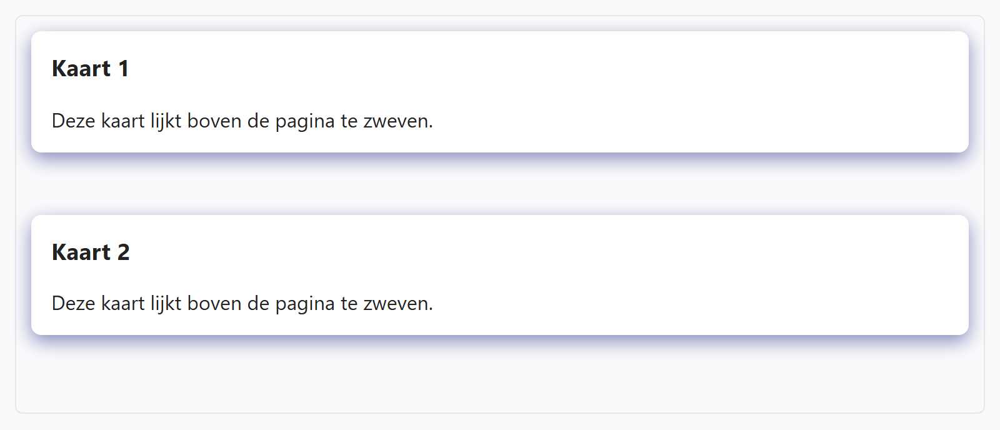

## Theorie

Met **box-shadow** leg je een schaduw onder een element, waardoor het boven de pagina lijkt te zweven. Je geeft vier waarden mee: de horizontale verschuiving, de verticale verschuiving, de vervaging (blur) en de kleur.

```css
.shadowed {
   box-shadow: 5px 10px 5px #888; /* x, y, blur, kleur */
}
```

Een verschuiving van `0` houdt de schaduw op die as gecentreerd. Combineer `box-shadow` met `border-radius` voor de klassieke *card look*, en houd de schaduw subtiel: een grote blur met een lichte kleur oogt natuurlijker dan een harde donkere rand.

## Opdracht

Creëer diepte met schaduw.

1. Geef de kaarten een schaduw: kleur `#88b`, horizontaal gecentreerd, verticaal `5px` naar beneden, en een blur van `15px`.
2. Geef de kaarten ook afgeronde hoeken van `8px` voor een "card look".

## Screenshot


