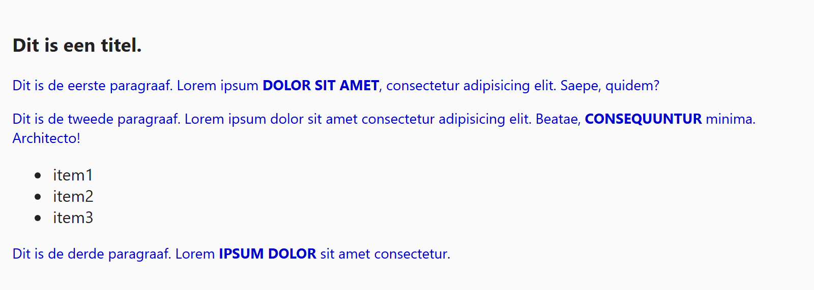

## Theorie

Een **tagselector** selecteert alle elementen van dezelfde soort. Je schrijft gewoon de naam van de tag, zonder punthaken. De selector `p` pakt dus élke paragraaf op de pagina, waar die ook staat.

```css
p { /* selecteert alle paragrafen */
   font-weight: bold;
   line-height: 1.5;
}
```

Tagselectoren gebruik je voor de basisopmaak van een pagina. Wil je maar één of enkele elementen apart opmaken, dan heb je een class of een id nodig.

## Opdracht

Selecteer elementen van één soort met een tagselector.

1. Maak alle paragrafen donkerblauw met `color: #00C`, en stel de lettergrootte in met `font-size: 14px`.
2. Zet alle strongs in hoofdletters met `text-transform: uppercase`.

## Screenshot


