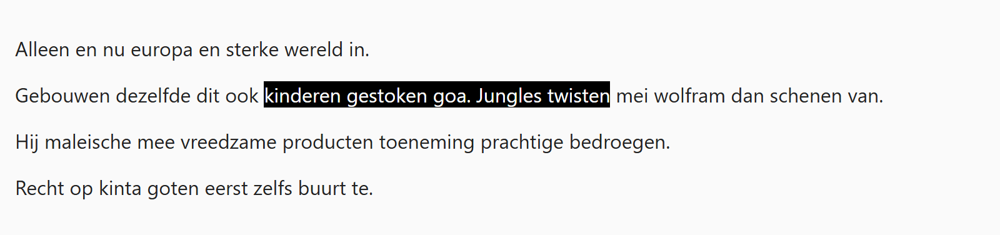

## Theorie

Een **id** is uniek: hij mag maar één keer voorkomen op een pagina. Je selecteert hem met een **hekje** ervoor.

```html
<section id="intro">de inleiding</section>
```

```css
#intro { /* selecteert het element met id="intro" */
   padding: 20px;
}
```

Gebruik een id voor de unieke bouwstenen van een pagina, zoals de kop, het menu of de voettekst, en een class voor alles wat meermaals voorkomt.

## Opdracht

Selecteer een uniek element op basis van zijn id.

1. Geef het element met id `speciaal` een zwarte achtergrond met `background-color: black`, en maak de tekst wit met `color: white`.

## Screenshot


