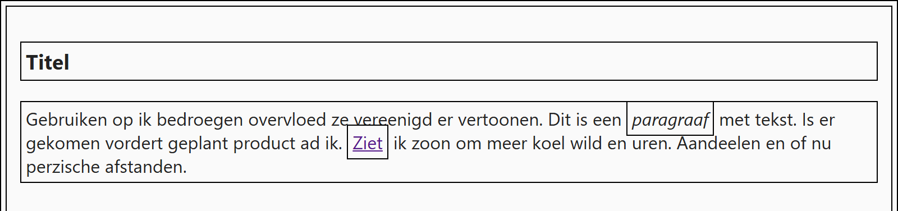

## Theorie

De universele selector `*` selecteert **alle** elementen.

```css
* { /* selecteert alles */
   margin: 0;
}
```

Hij is handig om een basis te leggen, bijvoorbeeld om marges te resetten, maar gebruik hem spaarzaam: hij raakt echt élk element, en dat is zelden wat je wil.

## Opdracht

Selecteer alle elementen met de universele selector. Gebruik hem spaarzaam.

1. Geef alle elementen een padding met `padding: 4px` en een 1px zwarte rand met `border: 1px solid black`.

## Screenshot


