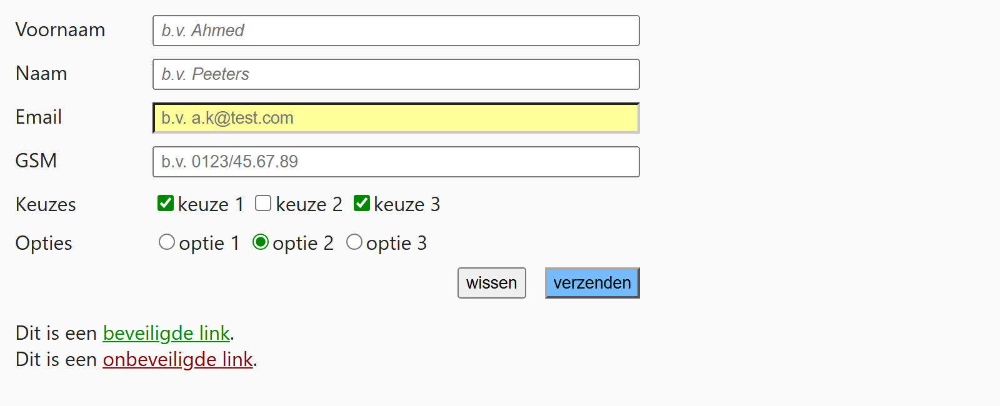

## Theorie

Met een **attribute selector** selecteer je elementen op basis van een attribuut, tussen rechte haken. Je kan enkel op het attribuut testen, of ook op zijn waarde.

```css
input[placeholder] { /* elke input mét een placeholder attribuut */
   border: 1px solid #aaa;
}

input[type=email] { /* enkel de emailvelden */
   background-color: #ff9;
}

[type=reset] { /* elk element met type="reset", ongeacht de tag */
   opacity: 0.6;
}

a[href^="https:"] { /* elke link waarvan de href begint met "https:" */
   color: #080;
}
```

Het dakje `^` betekent "begint met". Bevat de waarde leestekens zoals een dubbelpunt of een schuine streep, zet ze dan tussen aanhalingstekens.

## Opdracht

Selecteer elementen op basis van een attribuut, en optioneel op zijn waarde.

1. Zet alle tekstvelden (type="text") schuin met `font-style: italic`.
2. Geef het emailveld een gele achtergrond met `background-color: #ff9`.
3. Geef alle aangevinkte keuzes en opties een groene aanduiding met `accent-color: #080`.
4. Geef de verzendknop een blauwe achtergrond met `background-color: #7bf`.
5. Zet de beveiligde link (start met https:) in het groen met `color: #080` en de onbeveiligde link (start met http:) in het rood met `color: #800`.

## Screenshot


