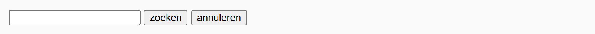
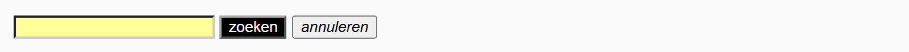

## Theorie

Een **pseudo class** selecteert een element op basis van zijn **toestand**. Je schrijft ze met een dubbelpunt achter de selector. De belangrijkste drie:

- `:hover` &ndash; de muis staat boven het element
- `:active` &ndash; er wordt op het element geklikt
- `:focus` &ndash; het element is geselecteerd, bijvoorbeeld een tekstvak waarin je klikt

```css
button:hover {
   opacity: 0.8;
}
```

De gewone stijlregel blijft gelden; in de pseudo class zet je enkel wat er verandert.

## Opdracht

Selecteer elementen op basis van hun toestand.

1. Geef de buttons bij hover een witte tekstkleur met `color: white` op een zwarte achtergrond met `background-color: black`.
2. Maak de tekst van de buttons bij active schuin met `font-style: italic`.
3. Geef het tekstvak bij focus een lichtgele achtergrond met `background-color: #ff9`.

## Screenshot



De drie toestanden samen: de muis boven de eerste knop, de tweede ingedrukt, en de cursor in het tekstveld:


