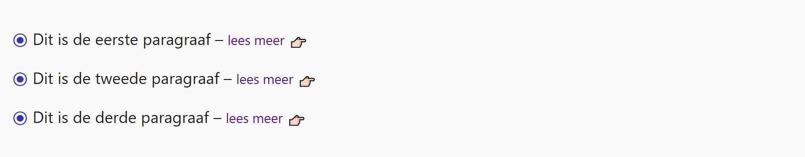

## Theorie

Een **pseudo element** is een stukje dat niet in de HTML staat, maar dat je met CSS toevoegt. Met `::before` en `::after` zet je inhoud vóór of na een element. Ze werken enkel in combinatie met de property `content`. Let op de dubbele dubbelpunt.

```css
li::before {
   color: #007;
   content: "→ ";
}
```

Gebruik dit voor inhoud die tot het **design** hoort, zoals een pijltje, een bulletje of een icoon. Echte inhoud hoort in de HTML thuis.

## Opdracht

Voeg met CSS inhoud toe aan het begin of het einde van elementen. 

1. Voeg vóór elke paragraaf het ⦿ karakter toe met de `content` property, en zet het in blauw met `color: #33b`.
2. Voeg na elke lees meer link de 👉🏻 emoji toe met de `content` property, en geef ze een linkermarge met `margin-left: 5px`.

## Screenshot


