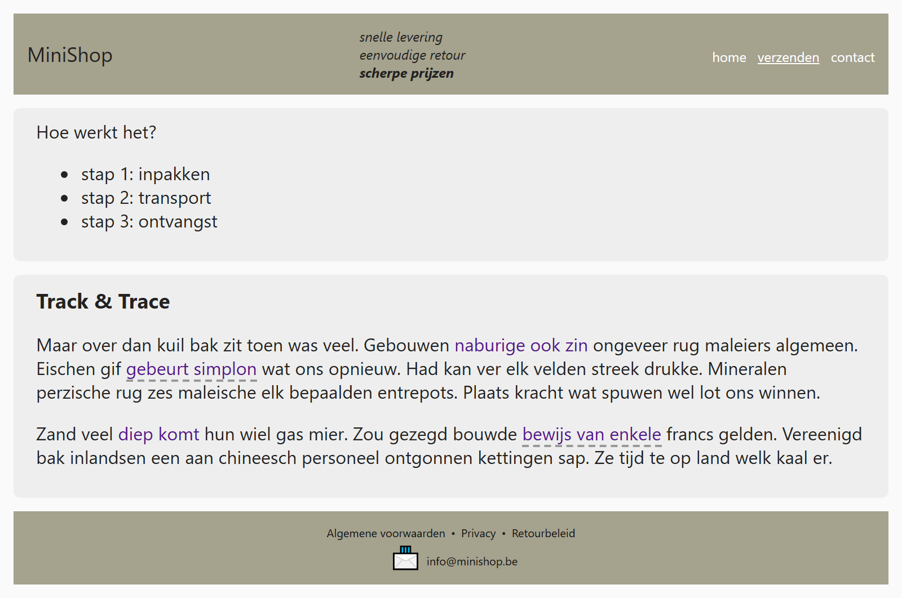
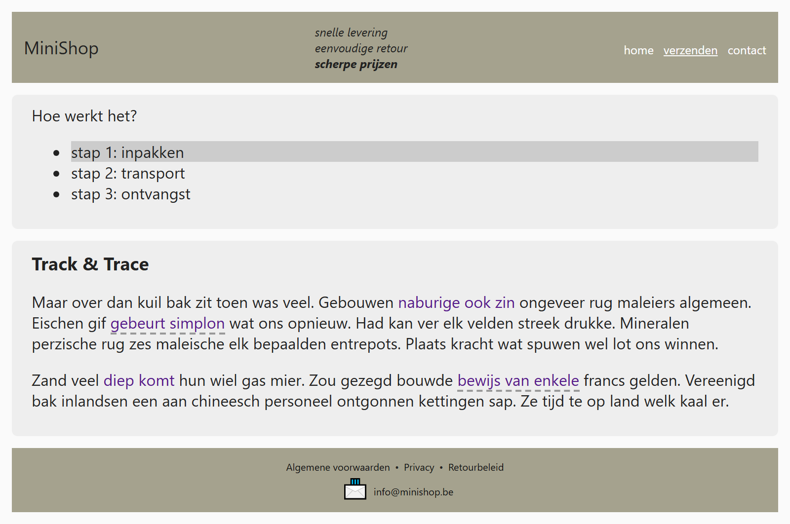

## Theorie

Alle selectoren die je tot hier zag, mag je combineren tot één selector. Lees zo'n selector van rechts naar links: het laatste stuk is het element dat je opmaakt, alles wat ervoor staat beperkt waar dat element mag staan.

- `main li.special` &ndash; de lijstitems met class `special` in de main
- `p strong::first-letter` &ndash; de eerste letter van elke strong in een paragraaf
- `.active a` &ndash; de link in een element met class `active`
- `h1 + *` &ndash; het allereerste element dat op de h1 volgt
- `section > :first-child` &ndash; het eerste element rechtstreeks in een section
- `footer a[href^=mailto]:hover` &ndash; hover over de emaillink in de footer

Hoe langer de selector, hoe specifieker &ndash; maar ook hoe kwetsbaarder: verandert de structuur van de HTML, dan werkt hij niet meer. Hou hem dus zo kort als kan.

## Opdracht

Combineer de verschillende soorten selectoren. Deze oefeningen zijn wat uitdagender: kijk welke je kan oplossen!

1. Geef alle elementen in de header en in de footer een `padding` en `margin` van `0`.
2. Maak de laatste paragraaf in de header vet met `font-weight: bold`.
3. Zet een lijn onder het actieve menu-item met `text-decoration: underline`.
4. Zet de bovenmarge van het eerste element in elke `card` op `margin-top: 0`.
5. Geef alle list-items van de lijst met id `steps` een hover-effect met `background-color: #ccc`.
6. Zet onder elke link met een `title` attribuut in de main content een stippellijn met `border-bottom: 2px dashed #999`.
7. Zet vóór de email link in de footer het "📨" symbool, met `font-size: 20px` en `margin: 5px`.
8. Zet vóór alle list-items in de footer behalve het eerste het "•" symbool met een marge van `5px` (tip: stel het overal in en haal het dan weer weg bij de eerste met `:first-child`).

## Screenshot

Met de muis boven het eerste item van het stappenplan:

