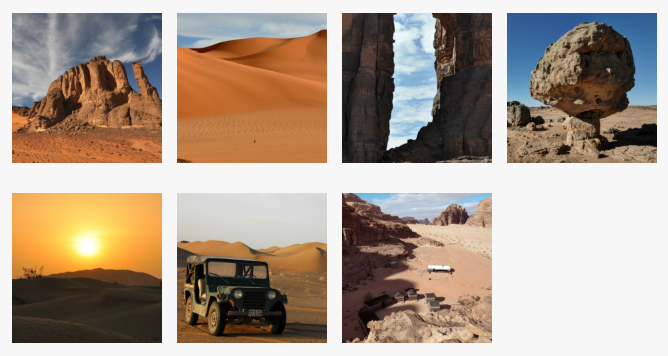

## Opdracht

Schik de foto's in een raster van meerdere rijen.

1. Maak van `.gallery` een flex-container.
2. Zet foto's op meerdere rijen met `flex-wrap`.
3. Gebruik `column-gap` en `row-gap` om 20px tussen rijen te zetten, en 10px tussen kolommen.

## Screenshot

