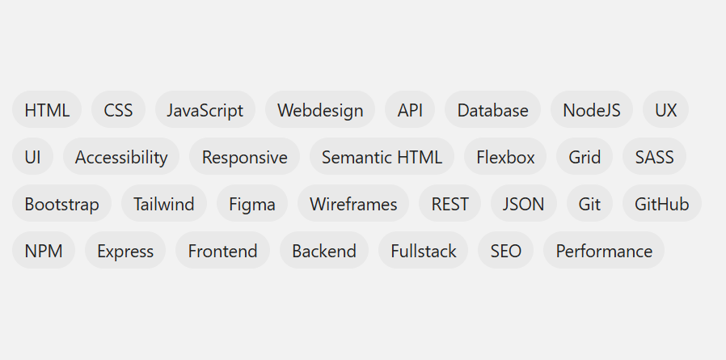

## Opdracht

Maak een tag cloud die in het midden van zijn vak staat.

1. Beperk de breedte van de container tot 600px met `max-width`.
2. Maak van de tags container een flex-container.
3. Zet tags op meerdere rijen.
4. Zet overal 8px tussenruimte.
5. Centreer de volledige content verticaal met `align-content`.

## Screenshot

