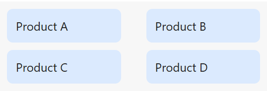

## Opdracht

Zet de producten twee per twee naast elkaar.

1. Maak de flex-container.
2. Zet producten op meerdere rijen.
3. Zet 10px tussen de rijen.
4. Zet producten zover mogelijk uit elkaar met `justify-content`.
5. Geef elk product een vaste breedte van 45% met `flex`.

## Screenshot

