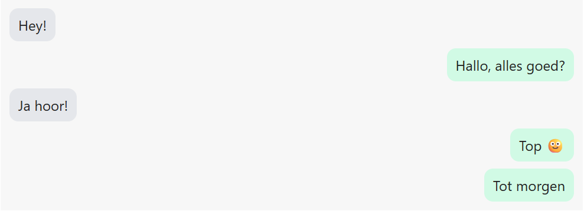

## Opdracht

Zet de berichten onder elkaar, links of rechts in het venster.

1. Maak de flex-container.
2. Zet het in kolomrichting met `flex-direction`.
3. Geef een 8px tussenruimte.
4. Gebruik `align-self` om de grijze berichten links, en nog eens om de groene berichten rechts te zetten.

## Screenshot

