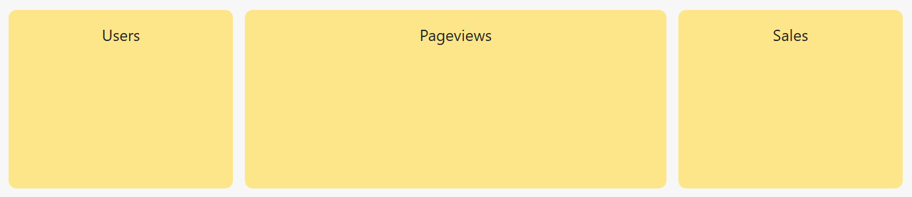

## Opdracht

Maak drie kolommen waarvan de middelste dubbel zo breed is.

1. Maak de flex-container.
2. Zet een 12px tussenruimte.
3. Maak de middelste kolom dubbel zo breed met `flex`.

## Screenshot

