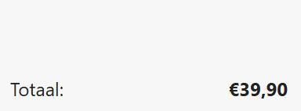

## Opdracht

Zet het totaalbedrag onderaan rechts in het vak.

1. Maak de flex-container.
2. Zet de items horizontaal uit elkaar.
3. Zet de items verticaal onderaan met `align-items`.

## Screenshot

